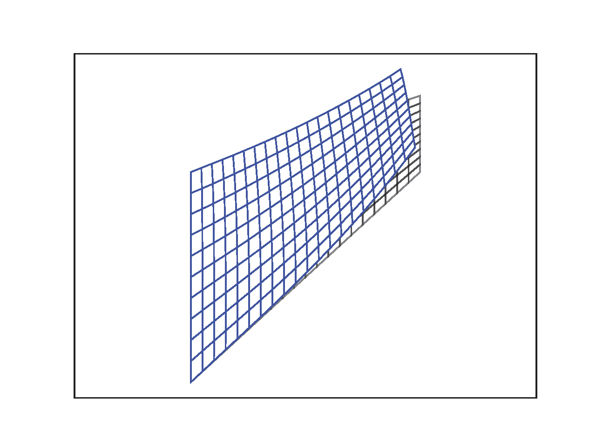
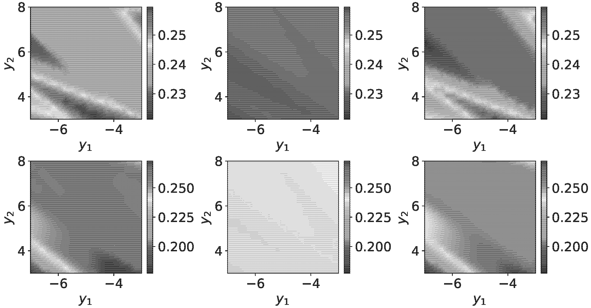

# Varitional Bayesian inference for finite element problem 
A variational Bayesian network is implemented for predicting unobservable mehcnical response using measurmenable quantities. The training framework is based on a finite element analysis module implemented with tesnforflow functions.

## Dependency
- numpy
- scipy
- matplotlib
- tensorflow 2.13

## FEM test
The finite element analysis of the Cook's membrane example can be tested by running
```
fem_test.py
```

The deformed shape can be shown as below:

 

## Benchmark
The variational Bayesian network is trained to predict von Mises stress at several locations of the Cook's membrane structure. The predicted mean values of the stress are shown as follows:

 

To train a variational Bayesian network, please run:
```
main_custom_training.py
```
